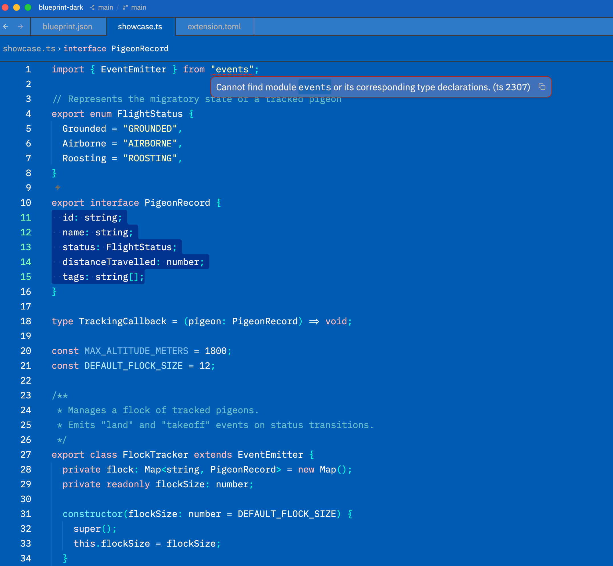

# Blueprint Dark

A dark theme inspired by the engineering blueprints of the 1800s, with a pragmatic twist in color choices for syntax highlighting.

## Installation

Find it in the Zed extension marketplace, search **Blueprint Dark Theme**, and install.

## Color Palette

### Editor

| Color | Hex | Usage |
|---|---|---|
|  Deep Blueprint | `#005DB3` | Editor background |
|  Blueprint | `#1360BD` | App background, status bar |
|  Blueprint Light | `#2F7AC8` | Panels, tab bar, surfaces |
|  Blueprint Dark | `#002791` | Active line highlight |

### Syntax

| Color | Hex | Usage |
|---|---|---|
|  White | `#FFFFFF` | Types, variables, properties |
|  Cyan | `#6EEFFF` | Functions |
|  Pale Yellow | `#FFFFB8` | Strings |
|  Rose | `#FFBDBD` | Keywords |
|  Teal | `#67BBC9` | Comments |
|  Mint | `#9FFCCC` | Attributes |
|  Lavender | `#F5AEF5` | Booleans |
|  Ice Blue | `#B5E7FF` | Constants |
|  Electric Teal | `#00FFE1` | Punctuation, brackets |
|  Pale Blue | `#D9ECFA` | Operators |

### Diagnostics

| Color | Hex | Usage |
|---|---|---|
|  Red | `#FF2600` | Errors |
|  Amber | `#FFA600` | Warnings |
|  Teal | `#15EBC3` | Modified |
|  Green | `#19FF00` | Created |
|  Pink | `#FFB5B5` | Deleted |

## License

[MIT](LICENSE)